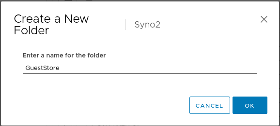
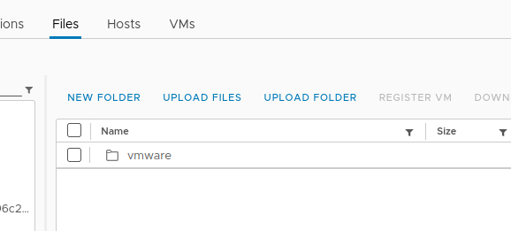

If your environment is offline, i.e. totally disconnected from the internet, it can be tough to update things. I've dealt with this with WSUS, SCCM, and now VMware Tools. Let's make it easy.

### The Hard Way

Updating Tools on the ESXi host required uploading to the datastore, chmodding, some esxcli commands, and setting up symlinks([Installing and upgrading the latest version of VMware Tools on existing hosts (2129825)](https://kb.vmware.com/s/article/2129825)). While this is fine, it is a few more steps than I would like.

### The New Way

Enter GuestStore. From VMware:

> The GuestStore feature provides a simple and flexible mechanism to distribute VMware specific or custom content from a GuestStore repository to multiple guests simultaneously.

Enabling the GuestStore feature makes it easier to update VMware Tools on your VMs. You can also use it for other purposes like distributing scripts or configuration files.

#### How to setup GuestStore

There are some requirements before setting up the GuestStore:

Windows VMs:

- ESXi 7.0 U2 and later
- VMware Tools 11.2.5 and later

Linux VMs:

- ESXI 7.0 U3
- Vmware Tools 11.3.0 and later

Creating the GuestStore is simple and only requires a few steps.

- Create the folder on the datastore
- Use esxcli to set the repository URL

##### Create the GuestStore directory

In your datastore create a directory called "GuestStore"



#### Configure the repo

SSH to your host. You may need to enable SSH first. 

First find the UUID of your datastore:

```
esxcli storage filesystem list
```

Then run this command:

```
esxcli system settings gueststore repository set --url "ds:///vmfs/volumes/<datastore_uuid>/GuestStore"
```

Ensure that it was successfully set:

```
esxcli system settings gueststore repository get
```

#### Upload the latest VMware Tools

Download the VMware Tools packages for GuestStore ZIP from [Download VMware Tools](https://customerconnect.vmware.com/en/downloads/details?downloadGroup=VMTOOLS1205&productId=1259&rPId=88838). Unzip it and then upload the vmware directory to the GuestStore directory you created on the datastore.



#### Updating VMware Tools

Now your VMs should be showing that a newer version of Vmware Tools is available to install.


### That's it!

In the next post I will go over how you can globaly configure VMware Tools to pull from the repo and install automatically.
